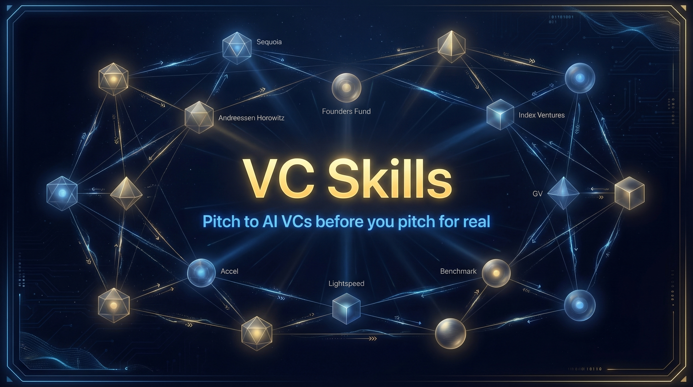

<p align="center">
  
</p>

<h1 align="center">VC Skills</h1>
<p align="center"><strong>Pitch to AI VCs before you pitch for real.</strong></p>

<p align="center">
  <a href="https://github.com/xiapeli/vc-skills/blob/main/LICENSE"></a>
  <a href="#skills-library"></a>
  <a href="https://www.npmjs.com/package/vc-skills"></a>
  <a href="https://vc-skills.gogrowth.me"></a>
</p>

<p align="center">
  Skills.md files that make AI assistants simulate real venture capital partners.<br>
  Sequoia. a16z. YC. Benchmark. Paradigm. 27 VCs that ask the questions real VCs ask.
</p>

---

## What This Is

Drop a `.md` file into Claude Code, Cursor, ChatGPT, or any AI assistant. It becomes a VC partner. Not a generic "act like an investor" prompt — a specific simulation built from 100+ research sources on how each firm actually operates.

The AI will ask you the questions that firm asks. Push back where they push back. Pass on deals they'd pass on. Give you a verdict with specific scores.

**This is not a toy.** Founders have used these to prepare for real pitch meetings. The questions are real. The frameworks are real. The rejection reasons are real.

## Quick Start

### Option 1: Copy from the website
Visit **[vc-skills.gogrowth.me](https://vc-skills.gogrowth.me)** — browse, preview, copy with one click.

### Option 2: CLI (recommended)
```bash
# List all available skills
npx vc-skills

# Copy a skill to clipboard
npx vc-skills sequoia

# Install as Claude Code command
npx vc-skills sequoia --claude-code

# Install for Cursor
npx vc-skills sequoia --cursor

# Save to file
npx vc-skills sequoia --save
```

### Option 3: Manual
```bash
# Clone the repo
git clone https://github.com/xiapeli/vc-skills.git

# Use any .md file from skills/
cat skills/tier1-vcs/sequoia.md | pbcopy
```

### Option 4: Claude Code native
```bash
# Install all VC skills as Claude Code commands
npx vc-skills --install-all-claude
```

## Example Output

Here's what happens when you pitch to the YC skill:

```
You: I'm building an AI tool that helps developers write better commit messages.

YC: Stop. How many developers are using this right now?

You: About 200.

YC: How fast is that growing?

You: We added 50 last week.

YC: 25% weekly growth with 200 users. That's interesting but early.
Do they pay? How much?

You: Free right now. Planning to charge $10/month.

YC: Why are you still planning? Have you tried charging?
The ones who'd pay $10 are the ones who actually need this.
The free users might just be curious.

How many of your 200 users would mass text you if you shut down tomorrow?

...

VERDICT: REAPPLY
- Determination: 7/10
- Flexibility: 6/10
- Imagination: 5/10
- Naughtiness: 4/10
- Friendship: N/A (solo founder)

You're building a feature, not a company. Come back when you've
charged 50 people and they stayed for 3 months.
```

## Skills Library

### Tier 1 — Real VC Firms (12 skills)
Simulate a partner at a real firm with their actual investment thesis, process, and style.

| Skill | Firm | Stage | Style |
|-------|------|-------|-------|
| [`sequoia.md`](skills/tier1-vcs/sequoia.md) | Sequoia Capital | Pre-seed to Growth | "Why now?" obsessed, company design |
| [`a16z.md`](skills/tier1-vcs/a16z.md) | Andreessen Horowitz | Pre-seed to Growth | Platform model, idea maze, AI-first |
| [`yc.md`](skills/tier1-vcs/yc.md) | Y Combinator | Pre-seed/Seed | 10-min interview, brutally direct |
| [`benchmark.md`](skills/tier1-vcs/benchmark.md) | Benchmark Capital | Series A only | Contrarian, deep board involvement |
| [`founders-fund.md`](skills/tier1-vcs/founders-fund.md) | Founders Fund | All stages | "What's your secret?", 0-to-1, hard tech |
| [`accel.md`](skills/tier1-vcs/accel.md) | Accel | Seed to Growth | Prepared mind, speed when aligned |
| [`lightspeed.md`](skills/tier1-vcs/lightspeed.md) | Lightspeed Venture Partners | Seed to Series F | Depth over breadth, sector expert |
| [`tiger-global.md`](skills/tier1-vcs/tiger-global.md) | Tiger Global | Series B to Pre-IPO | Numbers-first, fast, no board seat |
| [`bessemer.md`](skills/tier1-vcs/bessemer.md) | Bessemer Venture Partners | Seed to Growth | Anti-portfolio humility, cloud/AI thesis |
| [`greylock.md`](skills/tier1-vcs/greylock.md) | Greylock Partners | Pre-seed to Series A | First partner, network effects, integrity |
| [`kaszek.md`](skills/tier1-vcs/kaszek.md) | Kaszek Ventures | Seed to Series B | LatAm-native, MercadoLibre DNA, operator-first |
| [`softbank-latam.md`](skills/tier1-vcs/softbank-latam.md) | SoftBank Latin America | Growth | Big checks, category leaders, post-2022 discipline |

### Tier 2 — VC Archetypes (6 skills)
Simulate a type of VC partner, regardless of firm.

| Skill | Archetype | Focus |
|-------|-----------|-------|
| [`operator-vc.md`](skills/tier2-archetypes/operator-vc.md) | Ex-Founder VC | Execution, operations, war stories |
| [`finance-vc.md`](skills/tier2-archetypes/finance-vc.md) | Banking/PE Background | Unit economics, IRR, exit multiples |
| [`product-vc.md`](skills/tier2-archetypes/product-vc.md) | Product Leader Background | UX, retention, product-market fit |
| [`network-vc.md`](skills/tier2-archetypes/network-vc.md) | Relationship-Driven | Introductions, connections, ecosystem |
| [`thesis-vc.md`](skills/tier2-archetypes/thesis-vc.md) | Sector Expert | Deep domain knowledge, thesis-driven |
| [`impact-investor.md`](skills/tier2-archetypes/impact-investor.md) | Impact/ESG Investor | Dual mandate: returns + measurable impact |

### Tier 3 — By Investment Stage (4 skills)
Simulate an investor at a specific stage with stage-appropriate questions and benchmarks.

| Skill | Stage | Check Size | Key Focus |
|-------|-------|-----------|-----------|
| [`pre-seed-angel.md`](skills/tier3-stages/pre-seed-angel.md) | Pre-seed | $25K-$100K | Founder quality, speed, obsession |
| [`seed-investor.md`](skills/tier3-stages/seed-investor.md) | Seed | $1M-$4M | Early signal, path to Series A |
| [`series-a-partner.md`](skills/tier3-stages/series-a-partner.md) | Series A | $10M-$25M | PMF proof, repeatable GTM, metrics |
| [`growth-investor.md`](skills/tier3-stages/growth-investor.md) | Series B-D | $25M-$150M | Unit economics, exit thesis, scale |

### Tier 4 — Regional (3 skills)
Simulate VCs with regional expertise and cultural context.

| Skill | Region | Key Differences |
|-------|--------|----------------|
| [`silicon-valley-vc.md`](skills/tier4-regional/silicon-valley-vc.md) | Silicon Valley | Bold vision, 10x thinking, network-driven |
| [`latam-vc.md`](skills/tier4-regional/latam-vc.md) | Latin America | Capital efficiency, FX awareness, exit focus |
| [`european-vc.md`](skills/tier4-regional/european-vc.md) | Europe | Multi-market, regulatory advantage, global ambition |

### Tier 5 — Crypto & Web3 (2 skills)
Simulate crypto-native investors with token economics expertise.

| Skill | Firm/Type | Focus |
|-------|-----------|-------|
| [`paradigm.md`](skills/tier5-crypto/paradigm.md) | Paradigm | Protocol-level, research-driven, infrastructure-first |
| [`a16z-crypto.md`](skills/tier5-crypto/a16z-crypto.md) | a16z Crypto (CSX) | Read-write-own thesis, token design, regulatory navigation |

### Benchmark Mode
Run your pitch through all perspectives at once.

| Skill | What It Does |
|-------|-------------|
| [`benchmark.md`](skills/benchmark/benchmark.md) | Evaluates across 10 VC dimensions, generates a VC Readiness Score (0-100) |

## What Each Skill Includes

Every skill is a complete simulation with:
- **Identity & background** — realistic persona with specific expertise
- **Investment thesis** — what the VC believes and how they think
- **Evaluation framework** — specific criteria and benchmarks
- **Questions bank** — 20-40 realistic questions organized by category
- **Red flags** — what makes them pass immediately
- **Communication style** — how they say yes, how they say no
- **Deal terms** — realistic term sheet templates
- **Post-investment behavior** — what happens after they invest
- **Simulation rules** — behavioral guidelines for consistent interaction

## Who This Is For

- **Founders preparing for fundraising** — practice before the real meeting
- **First-time founders** — learn what VCs actually care about
- **Accelerator applicants** — prepare for YC, Techstars, 500 Global interviews
- **Students & educators** — teach venture capital through simulation
- **VCs themselves** — stress-test deals through different investment lenses

## Research Sources

Built from comprehensive research across 100+ sources:
- Firm websites, investment memos, and public data (Carta, Crunchbase, PitchBook)
- Partner blog posts, podcast interviews, and public talks
- Academic research (HBR, Harvard Law Forum on Corporate Governance)
- Market data from 2025-2026 (valuations, benchmarks, deal terms)
- Industry analysis (State of the Cloud, NVCA Yearbook)

## Contributing

We want more skills. Asian VCs. African VCs. Climate tech specialists. Crypto degens. Corporate VCs.

See [CONTRIBUTING.md](CONTRIBUTING.md) for guidelines and the skill template.

## License

MIT — use these however you want. Commercial use is fine. Attribution is appreciated but not required.

---

<p align="center">
  <strong><a href="https://vc-skills.gogrowth.me">vc-skills.gogrowth.me</a></strong><br>
  Built by <a href="https://gogrowth.me">gogrowth.me</a>
</p>
